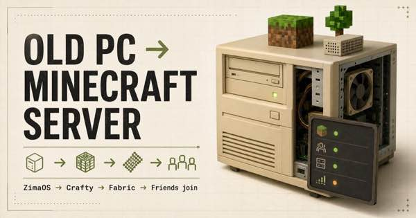

# Old PC to Minecraft Server

A polished, beginner-first field guide for turning an unused x86-64 PC into a self-hosted Minecraft Java server with ZimaOS, Crafty Controller, Fabric, Playit.gg or port forwarding, mods, security, and automatic backups.



## Live demo

Repository: <https://github.com/Squipy411/old-pc-to-minecraft-server>

## Run locally

Requires Node.js 22.13 or newer.

```bash
npm install
npm run dev
```

Open the local address printed by the development server.

## Quality checks

```bash
npm run typecheck
npm run lint
npm test
npm run build
```

## Project structure

- `app/page.tsx` — documentation shell, navigation, search, theme, progress, and hardware checker
- `app/markdown.tsx` — lightweight renderer and reusable callout, command, table, checklist, and consent-friendly video components
- `app/guide-content.ts` — chapter order, navigation groups, summaries, and estimates
- `content/*.mdx` — all 29 editable guide chapters
- `public/og.jpg` — project-specific social preview

## Edit guide content

Edit the relevant file in `content/`. Keep each major section under a level-two heading (`##`) so it appears in the table of contents. Inline links, lists, tables, fenced code, checklists, and `[!NOTE]`, `[!TIP]`, `[!WARNING]`, or `[!DANGER]` callouts are supported.

When a project interface or version requirement changes, update the instructions, retain a link to the current official source, and change the reviewed date in the site shell. Do not use old tutorial videos as the source of truth.

## Add a video

Videos load only after consent and use YouTube’s privacy-enhanced domain. Add a named video marker to the renderer, provide a complete written alternative in the chapter, and include an interface-age notice. Prefer official project channels.

## Contributing

See [CONTRIBUTING.md](CONTRIBUTING.md). Reports should identify the exact chapter, current official source, and the incorrect or missing instruction. Security-sensitive details such as public IPs, passwords, claim links, and access tokens must be removed.

## Licence and disclaimer

Code and original written content are available under the MIT License. Minecraft is a trademark of Microsoft/Mojang. This independent guide is not affiliated with Mojang, Microsoft, ZimaSpace, Crafty Controller, Fabric, Playit, Modrinth, CurseForge, or Balena. Self-hosting changes a home network and can erase drives; readers remain responsible for backups, electricity, network security, licences, and software compatibility.
